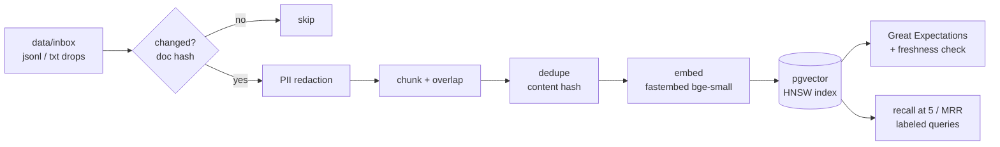

# AI-Ready Document Pipeline (RAG Data Layer)

The data-engineering half of a RAG system: an **Airflow** pipeline that ingests unstructured documents,
removes PII, chunks, deduplicates, embeds, and loads them incrementally into **PostgreSQL + pgvector**,
guarded by **Great Expectations** quality gates and a **retrieval-quality evaluation** (recall@k, MRR).
It does not call an LLM; it focuses on making the retrieval layer trustworthy.



## Pipeline behavior

| Concern | How it is handled |
|---|---|
| **Hourly incremental updates** | Airflow DAG `rag_ingest_hourly` re-reads the inbox, but a document is processed only if its hash changed. A second run with no changes writes nothing. |
| **Atomic updates** | Changed documents are replaced in one transaction (old chunks deleted, new ones inserted), so readers never see a half-updated document. |
| **Deduplication** | Chunks are hashed after whitespace/case normalization; identical chunks are stored once across all documents (`UNIQUE(content_hash)`). |
| **PII redaction** | Emails, SSNs, phone numbers and Luhn-valid card numbers are replaced with tokens before chunking and embedding. |
| **Quality gates** | Great Expectations checks null/length/uniqueness and confirms no PII pattern survived; a freshness check fails the DAG if the store lags the source. |
| **Retrieval evaluation** | `rag_eval_daily` computes recall@5 and MRR on a labeled query set and can fail below a threshold (`MIN_RECALL_AT_5`). |

## How the evaluation set works

`scripts/fetch_corpus.py` downloads the CNN/DailyMail dataset. For each sampled article, the human-written
**highlights** are the query and the **article** is the expected result. This is a labeled *known-item retrieval*
benchmark: it measures whether the pipeline can find the source article from a summary of it. It is not a
human-judged relevance set, so describe it that way if you quote the number.

## Quick start

Requirements: Docker, Python 3.11+.

```bash
python -m venv .venv && source .venv/bin/activate
pip install -r requirements-dev.txt

docker compose up -d postgres

# Option A - 2-minute demo with a tiny synthetic corpus (no download)
python scripts/make_sample_corpus.py
python scripts/run_ingest.py          # first run: ingests; run it again: everything 'unchanged'
python scripts/run_eval.py
python scripts/search_demo.py "interest rates"

# Option B - realistic run: ~25k real articles (needs internet; first embedding pass takes a while on CPU)
python scripts/fetch_corpus.py --docs 25000 --queries 500
python scripts/run_ingest.py
python scripts/run_eval.py --k 5
```

Run it under Airflow (development setup, first start is slow):

```bash
docker compose --profile airflow up airflow      # UI at
